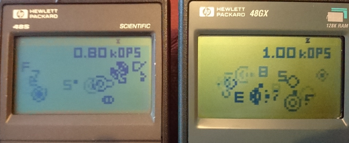
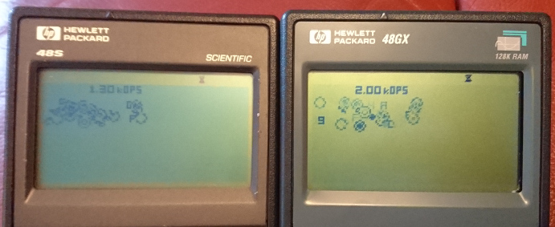

# Platform Speed

The HP48 calculator is much faster than the Cosmac VIP, but, there is still no solid understanding of how much faster it is for most instructions for the purposes of designing compelling programs with Octo. A [modified version of cmark77](https://johnearnest.github.io/Octo/index.html?gist=0b340c02d2c41c164fd6849a377dd235), a CHIP-8 graphical benchmark tool written by taqueso on the Something Awful forums running on an HP48 S yielded scores of 0.80 kOPs in standard/lores and 1.3 kOps in extended/hires. However graphical ops are significantly more costly than other ops on period hardware versus Octo (where they are basically free) and as a result a raw computational cycles/second speed assessment still has not been completed.

## Investigation

Here are a couple of photos of the benchmark running on the calculators in question:




### Estimated worse case graphical performance:
```
       Bench report:     Effective Octo Cycles
       lores    hires    lores    hires
S      0.80k    1.30k    13 cyc   21 cyc
G      1.00k    2.00k    16 cyc   33 cyc
```

### Notes
As noted, graphical operations are by far the most intensive operation on the platform; looking at the source code, they are the longest and largest routines by a notable margin. This benchmark draws 5 line font sprites, so, you can assume that drawing 10 line sprites would be again more costly.

The G series calculators pack a 4 Mhz processor, twice the speed of the 2 Mhz processor of the S series. This doesn't translate to double the speed however, as the memory clock is still 2 Mhz - the display is memory mapped into ram so, rendering operations such as this are still going to be limited by this. This is, however, still great news for non display based speed concerns, as there should be significant speed upgrades across the board everywhere else. The scale of this is, however, still very untested.