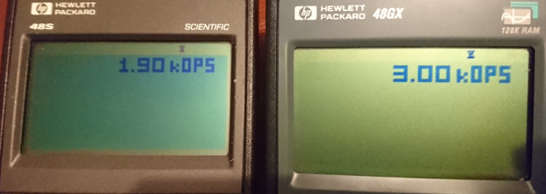

# Platform Speed

The HP48 calculator is much faster than the Cosmac VIP, but, there is no clear indication of how fast it is really is in interpreting CHIP code while trying to design compelling programs with Octo. The cmark77 program has been used and adapted to suggest that Octo speed settings of **13 to 32 cyc/frm** for HP48 S calculators, and from **17 to 50 cyc/frm** for HP48 G series calculators would be reasonable, depending on task, with hires mode actually improving the worst case graphical performance by almost double to give estimates of **22 to 32 cyc/frm** and **33 to 50 cyc/frm** on S and G respectively.

## Initial notes

Two [modified versions of cmark77](https://johnearnest.github.io/Octo/index.html?gist=0b340c02d2c41c164fd6849a377dd235), one converted to a [register math only](https://johnearnest.github.io/Octo/index.html?gist=33769016caeaf1728ad91bf0b701dd46) setup, have been used to estimate effective speeds. Cmark77 is a CHIP-8 graphical benchmark tool written by John Deeny, otherwise known as taqueso on the Something Awful forums, and running it on real hardware has generated approximations of performance based on a 50 instruction task.

Because graphical ops are significantly more costly than other ops on period hardware versus on Octo (where they are basically free), there have to be separate scores based on task being performed. Certain operations may be more costly (larger sprites) or full 16 register IO, but these figures are supposed to provide vague guidance on reasonable speeds to test your game at.

## Investigation

Here are a couple of photos of the benchmark running on the calculators in question:




### Estimated worse case gfx/best case math performance:
```
       Bench report:              Effective Octo Cycles:
       lores    hires    math     lores    hires    math 
S      0.80k    1.30k    1.90k    13 cyc   22 cyc   32 cyc
G      1.00k    2.00k    3.00k    17 cyc   33 cyc   50 cyc
%      +25%     +54%     +58%     +25%     +54%     +58%  
```

### Further Notes
As noted, graphical operations are by far the most intensive operation on the platform; looking at the source code, they are the longest and largest routines by a notable margin. The graphics benchmark draws 5 line font sprites, as well as some longer 7 or 8 line sprites, so, you can assume that drawing maximum line sprites (or 16x16 ones) would actually be even more costly, but, I don't think we need to lower the bottom line any farther.

In terms of hardware, the G series calculators pack a 4 Mhz processor, twice the 2 Mhz processor in the S series. However, they do share the same 2 Mhz memory clock, which is likely responsible for holding back the G - note that the display buffer, registers, and every CHIP instruction are all stored in ram and is has to be accessed constantly. Both devices are clearly quite capable of running at a higher speed when performing math/register manipulating instructions than graphics, and the gains due to the simplified process of accessing the display buffer in hires mode versus lores mode are surprisingly large. It's more than likely that the lores renderer could be rewritten for speed, as the hires renderer was moving from SC10 to SCHIP, but this would likely be a project for another day.