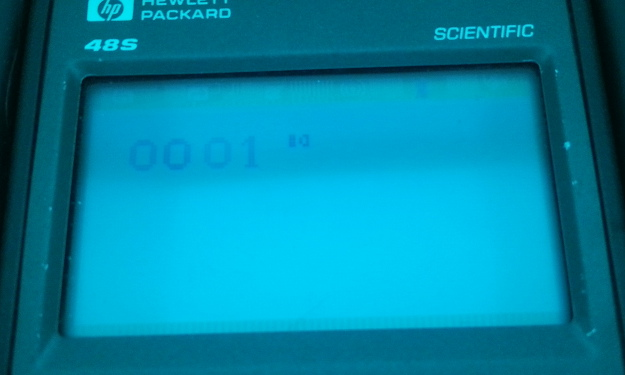

# Collision Enumeration
and 
# Collision with the bottom of the screen

+ An interesting and apparently often unnoticed change to the Super Chip spec is the following:
All drawing is done in XOR mode. If this causes one or more pixels to be erased, VF is <> 00, other-wise 00.
In SCHIP extended screen mode (aka hires) **only**, SCHIP 1.1 will report the number of rows that include a pixel that XORs with the existing data, so the 'correct' way to detect collisions is Vf <> 0 rather than Vf == 1. lores functions as expected.
+ In extended screen mode (aka hires) **only**, sprites that are drawn such that they contain data that runs off of the bottom of the screen will set Vf based on the number of lines that run off of the screen, exactly as if they are colliding.

## Initial notes:

While testing a variety of example roms when I first got my calculator, I discovered several things. Firstly, some games were missing collisions. Secondly, that sw8copter didn't really work at all. Sw8copter is a higher resolution game which uses some scrolling effects, and wants you to move between two girders without getting hit, and when you scroll off the top of the screen you reappear at the bottom.

## Investigation:

Since wrapping behavior was an area of interest, I made this program to test this, as well as collision behavior. You can move around 2 small boxes and see how they wrap around the edges of the screen, and how they generate collisions (you can't collide with the text) - the contents of vF are dumped into the two displayed hex digit pairs.

The program clearly shows that this platform does not wrap sprites around the edge of the screen, however that is not what this investigation is about. The program has been tested with both sc10 and SCHIP 1.1. In sc10, the behavior of the boxes corresponds perfectly with what we expect to happen: the boxes report a 1 if they touch each other and a 0 if not. No additional unusual behavior is observed, and nothing unusual happens in lores mode, either:

  
  
  
(There is significant flickering in this program, so I've enhanced this next image, it reads 00 01)  
  
  

However, in SCHIP 1.1, the following behavior can be observed:

  
  
  
  

In essence, in high res mode only, SCHIP 1.1 reports into vF, after a sprite draw, the number of horizontal rows that contain a collision with either existing graphics, or that run off of the bottom edge of the screen. No such behavior is observed horizontally, and the total number of pixels involved does not matter - only rows.

This means that any program testing for if vF == 1 for a collision will, when multiple rows collide, fail to detect a collision. Many programs I have seen created for Octojam detect collisions in this way.

As noted in the initial blurb, it turns out that in the SCHIP 1.1 release document, this enumeration change is actually kind of stated straight up: All drawing is done in XOR mode. If this causes one or more pixels to be erased, VF is <> 00, other-wise 00. It doesn't say *why*, granted, but it does state that if you want to detect them then you should use <> 0. This is a divergence from the regular behavior, which may be why it's limited to high resolution mode only, which technically is wholly the author's domain and he is, by rights, able to decide how things work in it. However, no one that I am aware of has, to date, written their games with this row counting feature in mind and as such it could probably be considered an undesirable feature - I have however seen people mention in old newsgroup messages that schip 1.1 broke their games that they wrote for sc10 due to objects failing to collide.

However, the collisions with the bottom of the screen are almost definitely a regression, and not intended: the cause of this should definitely be ascertained and resolved if possible.

## Investigation: Colliding Row Count in vF

First though, being that I am writing this section after the fact, I will take you through how the collisions are counted differently in the different screen modes. Each mode actually has its entire own different sprite drawing function. This makes sense when you note that, in lores mode the calculator is doing a bunch of work to double every pixel and coordinate etc up, and stepping around all that work would be quite slow - a separate routine makes more sense. Looking at sc10 and SCHIP, you can see that the regular sprite drawing calls have not changed between versions. They run from 00DE2-00EF8 and 00E81-00F97 respectively. The extended mode sprite drawing has however changed somewhat. The difference that applies mostly to us is this section:

```
sc10 source:
	and.wp	d,c		; now c = (old and new), a = old, d = new
	brz.wp	c,nocoll

	; there has been a collision; set nibble 14 in c
	swap.1	p,c,13		; save p in nibble 13 of c
	move.1	14,p
	move.p1	1,c		; set collision flag in nibble 13 of c
	swap.1	p,c,13		; restore p
nocoll:
	swap.wp	d,c		; now d = (old and new), a = old, c = new
	or.wp	a,c		; now c = (old or new)

sc10 disassembly
00DAA  C=C&D  WP
00DAE  ?C=0    WP
00DB1  GOYES   00DC0
00DB3  CPEX    13 				# Swap P into nibble 13 on C
		# Secret missing 2 nibble instruction at 00DB7, because DECODE, opcode: 2E = p= 14
00DB9  LC      1 				# Load C with 1, noting that LC uses the P register to determine the entry point
00DBC  CPEX    13 				# Restore P from nibble 13 of C
00DC0  CDEX    WP
00DC3  C=C!A  WP

schip disassembly
00E53  C=C&D  WP 				# This is our conditional check for colliding
00E57  ?C=0    WP
00E5A  GOYES   00E5F 			# Skip if no collision
00E5C  B=B+1   B 				# Add 1 to byte value of B (leaving S nibble alone)
00E5F  CDEX    WP 				# Continues - far fewer instructions => faster.
00E62  C=C!A  WP
```

Here we can see that things have changed slightly. The original way collisions were logged was by using P to write into a high nibble of C. P is a special 1 nibble register that can be used to write single nibbles into certain registers, but is also used in the LC instruction to determine where the write starts, and in WP field instructions, and I'm not even sure what else. Up until this point, it was something that I really didn't quite fully understand, honestly. This sequence modifies c.14 (the 14th nibble of c) to store a 1, which is later read as being the collision flag. I think that a) there's a mistake in the comments where they say they're storing the collision flag in 13, when they likely meant 14 and b) once again, DECODE leaves this instruction type out entirely. 

This method of storing collision state is still used when drawing lores graphics in SCHIP 1.1, which explains why there are no unusual behaviors there, but we have extended mode/hires change to review. In SCHIP, instead of modifying P and storing 1 in some high nibble of C, we are increasing the B register by 1 when we find that C&D is not 0 - note here that C is the whole row being written, it writes both bytes as a single word together for big sprites. This means that we are accumulating into the B register the number of rows that have pixels matching those already being displayed (aka collide).

On exit of these routines, these return to this code:
```
sc10
0091B  GOSUB   00CAD 					# Hires? Sprite draw call
0091F  GOSUB   00C69 					# Restore r registers
00923  GOSUBL  00415 					# Get vF
00929  C=0     B 						# Set Byte of C to 0
0092E  ?C=0    P 						# If C is non 0 in the P field (presumably has the C flag set)
00931  GOYES   00936 					# Either leave C as 0
00933  C=C+1   B 						# Or add 1 to it (ie, set it to 1)
00936  DAT0=C  B 						# Save into Dat0, which is pointing at vF due to the varfpd0 call above
0093B  RTNCC

schip
00A2E  GOSUB   00D85 					# This is the high res draw routine
00A32  GOSUB   00D50 					# This is r_rregs
00A36  GOSUB   0036B 					# This is varfpd0
00A3A  C=B     A 						# This is taking the value that is in B and saving it into C, and thus vf
00A3C  DAT0=C  B 						# Save value.
00A3F  RTNCC 							# Return
```
Here we can see that, in sc10, the low byte of C, nibbles 1 & 2, are set to 0, then if the P field of C is nonzero, it adds 1 to the byte in C, and saves that byte into DAT0, which is aimed at vF's memory via varfpd0. Given that we know that we are storing a flag in a high nibble of C, we can get a feel for how this must be working - storing a 0 or a 1 into vf depending on if the flag is set. In SCHIP, the value of B is copied wholesale into C, and then written to vF - thus, all the colliding rows are saved into vF, and that information is available to the chip-8 program, which is exactly what we observe in the test rom.

That I think concludes the investigation of vF = collision rows.

## Investigation: Edge Collisions

Now for the row reduction code, which is nestled just before the code we talked about just above. Here is the full code from SCHIP 1.1 for handling the sprite x y n call. Pay particular attention from about 00A09, where C will contain the number of rows you are asking to draw for your sprite.

```
009C5  GOSUB   00D1B 		# entry		# Calls s_rregs - saves the r0-3 registers
009C9  C=R0 							# Get I (bytes)
009CC  C=C+C   A 						# Convert to nibbles
009CE  A=R2 							# Get memory start pointer
009D1  C=C+A   A 						# Add this on top
009D3  R0=C 							# save this in r0; r0 now points to sprite
009D6  GOSUB   00392 					# xcya routine - obtains x/y coords from sprite call into C and A
009DA  D=C     A 						# Save X in D
009DC  LC      3F						# Masks Y from 0-63
009E0  A=A&C   B 						# Store in A
009E4  LC      7F 						# Masks X from 0-127
009E8  D=D&C   B 						# Leave in D
009EC  D1=D1+  2 						# 'get the number of bytes in the sprite (preserving a and d)'
009EF  C=0     W 						# Pointing at N field, ie, row count in sprite instruction
009F2  B=0     W 						# NEW IN SCHIP - set B to 0. Probably fixes a bug.
009F5  C=DAT1  1 						# Load N count from instruction into C
009F9  ?C#0    P 						# if not 0, (ie, not a big sprite)
009FC  GOYES   00A07 					# Skip these next 2 instructions
009FE  C=C+16  B 						# Add 16 to the value of C - the row length, which is currently 0
00A04  B=B+1   S 						# B = B+1 in the S field - S field is the highest nibble, F
00A07  RSTK=C 							# Store this value on the stack.
00A09  C=C+A   B 						# Add it to A, which is the starting Y value, to calc the bottom row pos
00A0C  B=C     B 						# Set B to this value (byte field)
00A0F  LC      40 						# Load 40 into C, the height of the display
00A13  B=B-C   B 						# Subtract this value from B: This computes overdraw rows.
00A16  GONC    00A1C 					# If the carry bit is not set, ie, value is >= 0, jump over
00A19  B=0     B 						# Setting B to 0
00A1C  C=RSTK 							# Restore the value of C from the stack (# of rows)
00A1E  C=C-B   B 						# Subtract overdraw row value to ignore these rows completely
00A21  P=C     0 						# Copy adjusted length into P
00A25  C=P     15 						# Store this in nibble 15 of C
00A2B  D1=D1-  2 						# Point back at start of instruction
00A2E  GOSUB   00D85 					# This is the high res draw routine
00A32  GOSUB   00D50 					# This is r_rregs
00A36  GOSUB   0036B 					# This is varfpd0
00A3A  C=B     A 						# This is taking the value that is in B and saving it into C, and thus vf
00A3C  DAT0=C  B 						# Save value.
00A3F  RTNCC 							# Return
```

If that's too much to digest in one go, the crux is that; before the sprite draw methods are called, the number of overshoot rows are calculated, and if there are any, they are removed from the sprite instruction's N value. This prevents any drawing outside of the viewport, and shows clearly that there is no wrapping. But, it also does something else:

It betrays why overshoot rows are being counted as colliding, even if they are 'empty' rows of a sprite. If there is an overshoot, that value is stored in B and is used to reduce the N value (row length) in C. Then, at no point between here and the code we discussed in the section above, where it accumulates collisions in the low byte of B, does it clear the value in that register - the overshoot row data is just hanging around in B, and accumulated on top of if there happen to be any further collisions. As a result, row overshoot data is sitting preloaded in the B register and then copied into vF once the drawing code has finished.

## Fixing it

This one is difficult: is the number of rows being stored in vF something that I should fix? Or, is it a feature? For the sake of having done so, I'm going to work out how to stop it from happening, and given that as far as I am aware, no roms use this, 'fixing' it expands the quantity of software my version of the interpreter could run. As such, I think I'm going to fall on the side of changing it and noting that if anyone wants to use this feature, they can work with the existing schip 1.1 quirks of their own accord.

With that accepted, the quest begins. Immediately after we return from the high res draw, we call a familiar routine, one that we moved earlier when fixing the I quirk; r_rregs. This routine is the one we moved to the very end of the program, and only one other routine calls it - low res draw. There are 2 key things to know about this: Firstly, we are in complete control of it and could easily add code before it, such as setting B to 1 if it is not equal to 0, and secondly, it is a 0x35 nibble long routine that used to be located 0x35 nibbles before the start of the high res sprite draw routine that the sprite command handler calls (GOSUB 00D85). This is exceptionally fortunate, considering I hadn't realised this at all when I was deciding to move these routines out to the back end of the program, and makes fixing this almost a doddle as there are no concerns at all about having the space to write the code we need.

## Fixing overdraw

Here is the start of the sprite draw function as it exists in my SCHPC now - padded with returns up to 00D85
```
00D81  RTN
00D83  RTN
00D85  C=A     A
00D87  A=A+A   A
```
Setting B to 0 in the A field is opcode D1, so inserting this into 00D83 and changing the GOSUB call at 00A2E to point to 00D83 instead of 00D85 should fix this problem on the spot:

```
00A2B  D1=D1-  2
00A2E  GOSUB   00D83
00A32  GOSUB   0111F
...
00D81  RTN
00D83  B=0     A
00D85  C=A     A
00D87  A=A+A   A
```

  

I verified that this did not appear to upset 16x16 sprites (which write into a high nibble of B), and they do not appear to have been impacted.

## 'Fixing' row counter

When calling my relocated r_rregs routine at 111F, I'll insert some bytes before thand that do the following:
```
?B=0
GOYES r_rregs
B=0
B=B+1
r_rregs...
```

This is needed because you can't just load a value into B, the instruction for that does not exist; you'd have to do it via the C register and then set B to C, and this just seems like a reasonably straight forward alternative method of working around that. I think I'm fine using the A field for all of this:

```
?B=0 8A9
GOYES r_regs 60 
B=0 D1
B=B+1 E5 
r_rregs

# Change of plans, use B field for B=B+1, which is 3 nibbles, keeping the length even and therefore keeping the existing nibble alignment, don't wanna nibble shift r_rregs all over again... 
B=B+1 Ba5 where a is field => B65 for Byte field
+ change GOYES value to 7

current hex editor data:
04 11 41 43
new hex editor data:
04 81 9a 07 1d 6b 15 

Result:
01122  GOYES   01129
01124  B=0     A
01126  B=B+1   B
01129  A=R4
0112C  LC      001B1
```

Now we change the 111f call at 09A7 to be 01129 since we don't want to upset the regular drawing code, and modify the length of the string to match the new length.

  

No regressions or unusual behavior has yet been observed with this change. You'll also be glad to hear that sw8 copter is now 100% playable.