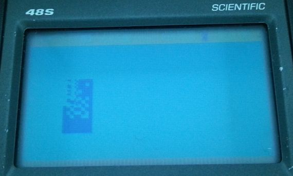

# Swapping Display Modes

Superchip has two different display modes, 64x32 and 128x64. When swapped between, the display buffer is not cleared. Pixels are modified based on being XORed in 1x2 vertical columns, so odd patterns can be created.

## Initial notes:

Because of the memory cost of full screen bitmaps, it's pretty popular for people making Octo games to make a title screen in lores, but have their gameplay be in hires. This means that the display mode is changed as the game is played.

When we approach this from a modern perspective, the canvas changes size and the old one is discarded, especially since the graphics are basically incompatible. This, the pervading assumption is that the existing contents are wiped out, as if a clear command were called.

## Investigation:

This is quite simple to test, simply by drawing something to the display buffer and changing screen mode. For this purpose, I wrote [this program](http://johnearnest.github.io/Octo/index.html?gist=11c9d501c2ad894161458846423129cd) - it accepts keypad input and cycles through some graphics. The graphics are drawn as a 15 row sprite, stacked vertically in hires mode to be 30 high.

Step 1, lores draw:  
  
Step 2, swap to hires:  
  
Step 3, hires draw top left:  
  
Step 4, hires draw remaining area:  
  
Step 5, swap to lores:  
  
Step 6, lores draw:  
  
Step 7, clear:  
  

We can see clearly that swapping display mode does not clear out the display buffer on superchip 1.1. However, we can also see that something else is going on. In principal, in step 6, we draw the sprite that we drew in step 1 again. This should 'undo' the drawing of this image from the display buffer, and give us the hires test pattern we see in Octo in step 4. However, we do not; instead we see a different pattern.

I have reproduced the exact pattern for you here:  


The pattern's causation may not be instantly apparent, however, if you example the bottom section, I have isolated the row where each of the 2 right hand side's patterns start. It isn't repeating just this row, though, it repeats every even row of hires content to the row below it; what we appear to be seeing is the 'correct', 128 px resolution XORing of the even row row of pixels (even though we're in low resoltuion) but with that outcome duplicated over whatever was in the odd row below it.

At some point I think I've established that the low resolution draw code hasn't changed from superchip 1.0 to superchip 1.1, so let's review the source to try and ascertain if this is indeed the case.

```
	swap.wp	d,c		; now d = (old and new), a = old, c = new
	or.wp	a,c		; now c = (old or new)
	not.wp	d
	and.wp	d,c		; now c = (old or new) and not(old and new)

	move.wp	c,@d0		; store once
	add.a	16,d0		; advance by 34 to next scan line
	add.a	16,d0
	add.a	2,d0
	move.wp	c,@d0		; store again
	move	0,p
```

Here we see initially the way it xors the graphics (it has detected collisions prior) without actually using xor. This is because, apparently/almost unbelievably, XOR isn't actually available on the HP48. Anyway, once we've done that, it's stored to d0, which is incremented by 34 and then the same result is stored again. In this case, 34 seems to be the memory difference between each row of the display, based on information I found regarding [GROB objects](http://www.hpcalc.org/hp48/docs/faq/48faq-8.html). The only point of concern with this strategy is that, the upper area of the HP48's display, the stack area, is allocated in a different place to the device's menu bar, and thus has a different pointer and the allocation is in a different place, but fortunately for this approach, the upper and lower area are both an even number of rows, so it will never run afoul.

## Fixing it

Currently, there is no accepted outcome for when the draw buffers collide that I'm aware of, so perhaps the switch mode routines should call 'clear'. This could possibly be arranged, however return is a 2 nibble statement and the shortest jump is 4, so, it would require some rearrangement to accomplish.

This type of 'fixing' isn't really needed, as superchip determines its true functionality, however people may have assumed this behavior in Octojams and it seems reasonable to modify SCHPC to also perform a clear.

The enable and disable extended mode in sc10 are handled as separate commands, which is perhaps a bit needless, so if their locations can be isolated in schip, it should be quite possible to change them to set eg the B register to something and jump into common code, which then jumps into clear, which is only a one instruction handler (for subroutine return) above them. Or at least this is the case in sc10.

Having tracked this down in SCHIP's disassembly, by looking for things that might be the instruction detectors and nearby a=r4s:

```
004D7  LC      FF 			# Load FF to test for Enable Extended instruction
004DB  ?A#C    A 			# Does this not match our instruction?
004DE  GOYES   004FB 		# If no match, jump over handler
004E0  A=R4    A 			# This looks a lot like Enable extended mode
004E6  LC      001C5 		# Load the offset to the nibble which stores this info
004ED  C=C+A   A 			# Add it to the memory start point
004EF  D0=C 				# Stuff that into d0
004F2  LC      F 			# Load F into C
004F5  DAT0=C  P 			# Stuff F into this memory location
004F9  RTNCC 				# End of enable
004FB  C=C-1   B 			# Seems to be detecting FE instead of FF via a quick method
004FE  ?A#C    A
00501  GOYES   0051D
00503  A=R4    A 			# This looks a lot like Disable extended mode
00509  LC      001C5
00510  C=C+A   A
00512  D0=C
00515  C=0     A 			# Same as before but stuff 0 into it instead
00517  DAT0=C  P
0051B  RTNCC 				# End of Disable
```

These routines don't appear to be being called from anywhere else, so it should be safe to edit them. If we instead change this to do something like the following

```
if !FF -> NextHand_a
C = F
B = C
-> CommonSwapMode
NextHand_a:
if !FE -> NextHand_b
B = 0
CommonSwapMode:
A = R4
C = Offset
C += A
D0 = C
C = B
@D0 = C
RTNCC
...
NextHand_b:
(existing code at 0051D)
```

Then this should compact down the existing code sufficiently to allow us to fit in the extra instructions. Naturally, this will make hires and lores slower instructions, but, realistically, no one is calling these instructions with any frequency. We pretty much have all of the instructions we need to do this present in the area except for B = C, which I should be able to get from the saturn instruction set but, uh, we've had trouble with that before. Let's start disassembling. 004D7 should be around byte 0x278. The Hex editor's showing me 33F18F6A for the next few bytes, so, there's our LC FF, which is 31FF:

```
SCHIP 1.1 Disassembly w/ByteCode
004D7 31FF    LC FF
004DB 8A6     ?A#C A
004DE D1      GOYES, PC += 1D = 4FB
004E0 81AF14  A = R4 A
004E6 345C100 C = 001C5
004ED C2      C = C + A
004EF 134     D0 = C
004F2 30F     LC F
004F5 1540    DAT0=C
004F9 03      RTNCC
004FB A6E     C=C-1 B
004FE 8A6     ?A#C A
00501 C1      GOYES, PC += 1C = 51D
00503 81AF14  A=R4 A
00509 345c100 C = 001C5
00510 C2      C=C+A A
00512 134     D0 = C
00515 D2      C=0 A
00517 1540    DAT0=C  P
0051B 03      RTNCC
0051D A6E     C=C-1   B
```

According to the Saturn document I use, B = C is D9, B = 0 is D1, C = B is D6. In reality, B=C is D5, B=0 is indeed D1, and D9 is actually C=B. 6### will be jump to an address offset from the start of the ### value. In this case, the clear instruction is handled at 00459.

```
SCHPC New ByteCode
004D7 31FF    LC FF
004DB 8A6     ?A#C A
004DE B0      GOYES, PC += 0B = 4E9
004E0 30F     LC F
004E3 D5      B = C
004E5 6D00    GOTO COMMON (4F3 - 4E6 = D)
004E9 A6E     C=C-1 B
004EC 8A6     ?A#C A
004EF E2      GOYES, PC += 2E = 51D
004F1 D1      B = 0
004F3 81AF14  A=R4 A <<< COMMON
004F9 345c100 C = 001C5
00500 C2      C=C+A A
00502 134     D0 = C
00505 D9      C=B A
00507 1540    DAT0=C  P
0050B 6D4F    GOTO Clear, @00459, 0050C -> (2048 - (50C - 459)) | 2048 = F4D
 (padding)
 0051D A6E     C=C-1   B (this is at 0x29B in file)
```

Yielding (after going back and forth to get the above right) a Disassembly output of:
```
004D7  LC      FF
004DB  ?A#C    A
004DE  GOYES   004E9
004E0  LC      F
004E3  B=C     A
004E5  GOTO    004F3
004E9  C=C-1   B
004EC  ?A#C    A
004EF  GOYES   0051D
004F1  B=0     A
004F3  A=R4    A
004F9  LC      001C5
00500  C=C+A   A
00502  D0=C
00505  C=B     A
00507  DAT0=C  P
0050B  GOTO    00459
0050F  RTNSXM
00511  RTN
00513  RTN
00515  RTN
00517  RTN
00519  RTN
0051B  RTNCC
0051D  C=C-1   B
```

So, that ought to do the job, and, when testing with the calculator, does work. Honestly I could put photos here but the bottom line is that it clears the screen and matches Octo's behavior now.