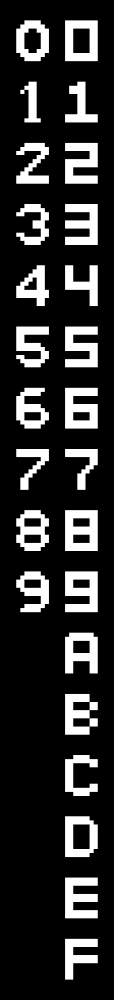
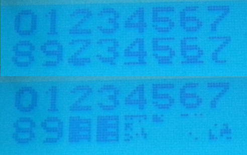

# Large Font

Superchip includes a larger font. This font does not include hex characters A through F - the spec actually states this but I'm not sure anyone realised.

## Initial notes:

When investigating some of the quirks, an on screen display was needed to show what was going on. It quickly became apparent that there were no large hex characters in the large font, as the random junk that turned out to be the uninitialised contents of low memory were displayed.

## Investigation:

Checking on the spec, it pretty clearly states as follow:

```
FX29     Point I to 5-byte font sprite for hex character VX 
FX30*    Point I to 10-byte font sprite for digit VX (0..9)
```

You can see there that, Bighex simply only offers 0..9 as valid values. However, it doesn't enforce this limit wrt the command:

```
	clr.a	c
	clr.a	a
	move.p	@d0,a	; use low nibble of variable
	move.p	a,c
	add.a	a,a	; * 2
	add.a	a,a	; * 4
	add.a	c,a	; * 5
	add.a	a,a	; * 10
```

This shows, no filtering is done, and that it will still use the whole low nibble to address, so, if characters were defined, they would be displayed.

Additionally, it became apparent that the Large Font that Octo uses isn't sourced from Superchip. Here is a comparison of the two side by side:



Additionally, there is one change to the bighex font from sc10 to schip, which is the filling in of the inside corners of the 0. sc10 is on top, schip on the bottom (the sc10 picture was actually taken 2nd, note how the previous data has ended up in the uninitialised area of memory for values A-F)



## Fixing it?

No games I've tried actually rely on the large hex characters being present, and, I would be simply drawing my own characters to add in their place. As such, I'm going to leave this open ended, with the suspicion that things will stay as they are.

If I was going to pursue a fix, I would likely be increasing the packed data at the end of the binary to include the 6 hex characters, and modify the initilisation routine to copy more data from the pointer that it uses to low memory:

```
ref18:	move.p5	hexf810-ref18,c
	add.a	a,c
	move.a	c,d1
	move.p2	40,a		;only from 0-9
fcopyl2:
	move.a	@d1,c
	move.a	c,@d0
	add.a	5,d0
	add.a	5,d1
	dec.a	a
	brnz.b	a,fcopyl2
```

Each character is 10 bytes, or 20 nibbles, so there are a total of 200 nibbles, so, since it's reading with the a field, which is 5 nibbles (also the pointers are moved on by 5), we can justify the magic value of 40 that is moved into the a register. 

Naturally, since I've already stuffed some code on the end of the program, changing this would upset a lot of that, but, I guess that comes with the territory.