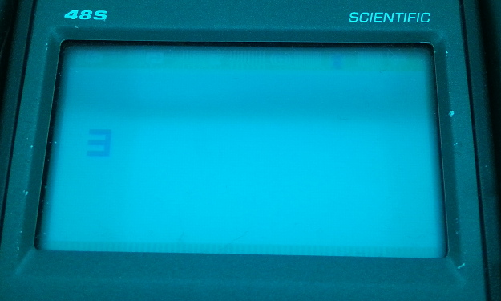
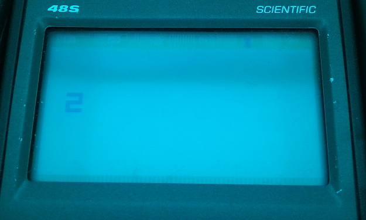
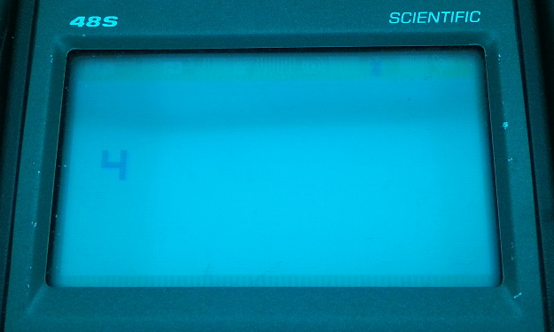

# FX55 & FX65

Saves/Loads registers up to X at I pointer - VIP: increases I, HP48-SC: I remains static

## Initial notes:

When you load/store n registers to I, on the cosmac VIP, your I pointer would increment by n such that you could read through all of your memory if chunks of n by repeatedly loading. However, superchip roms exist that demonstrate that they expect I to remain static when reading, allowing you to read the same piece of memory over and over again.

## Investigation:

So, this is probably my favourite quirk that I've checked out. If you're familiar any with Chip-8 Emulation history, this quirk, along with the bit shift quirk, are the big two differences that come up when dealing with schip programs. One of the first things that was done when my calculator was able to run binaries was to run a selection of test programs that displayed that it was behaving the ways we expected, this quirk included, and it clearly was so we all patted ourselves on the back about how right we were. The I indeed remaining unchanged, and well, ultimately I'll show that this is what happens, but when I was originally investigating this, I got a bit of a surprise.

If you think about the way chip-8 is implemented on the HP48, you can realise why this quirk might arise - the I register is stored in r0, and has to be moved into the working registers and then into one of the d0 or d1 pointer register to be made use of. This means that you're not using the value directly, so when you might have to modify it to point at your next piece of data, you don't end up modifying the saved data in r0 at all. And I expected to see this bear out. Since we have source code for 2 of the binaries, this is where I started (this is from sc10):

```
; setup subroutine for fx55 or fx65 instruction
;
; In: d0 points to VX
; Out: d0 points to to V0, a points to VX, and d1 points to MI
copysetup:
	swap.a	c,d0		; copy d0 to c
	move.a	c,d0
	push.a	c			; save pointer to the last variable
	call.3	var0pd0		; point d0 to first variable (v0)
	move.a	r0,c		; get I
	call.3	virtophy		;;; virtophy takes a chip 8 address and converts to the calculator's memory
	move.a	c,d1		; point d1 to data at I
	pop.a	c
	move.a	c,a			; now a contains pointer to last var.
	ret

...
ifx55:	; save vars in memory
	call.3	copysetup
savelo:
	move.b	@d0,c		; read a byte from variable
	move.b	c,@d1		; store in MI
	swap.a	c,d0		; get d0 to c
	move.a	c,d0
	brge.a	c,a,doret1	; are we ready yet?
	add.a	2,d1
	add.a	2,d0
	move.a	r0,c		; get I value
	inc.x	c			; increment 3 low nibbles
	retcs				; if carry, we might overwrite #1000
	move.a	c,r0		; I changes permanently
	jump.3	savelo
doret1:
	retclrc
```

Now, the astute amongst you may have noticed something. That would be that saucy little comment: "I changes permanently". This subroutine definitely updates I as it iterates over the write - which is very much at odds with expectations. This routine starts with d0 pointing at the initial register (v0) and d1 pointing at what I was pointing at but in calculator memory. The loop reads a byte from location d0, and saves it into d1, reads the base pointer out of d0 into C then saves it back into d0 (because we swapped it with the data we wanted to save). Then it checks if C >= A; you'll note that the last instruction of copysetup puts a copy of our end pointer into A - we do this because we can't check d0 vs d1 directly. Then, if this check fails, it knows it hasn't written the last byte of data yet, and it adds 2 (nibbles) to the pointers, moves the r0 value (which is I) to C, increases it with the X field (3 low nibbles) so it can crash the program out if this overflows 0xFFF, then stuffs the result back into r0.

The quirks test program we use, it turns out, has a fatal flaw. If you're any good at loop analysis you'll have noticed that, unlike the behavior on the VIP, while this code does change I, it will not increase it one the final time when it completes, as the loop will exit from the brge - skipping the add 2 and saving to I.

And so, a test program was written: http://johnearnest.github.io/Octo/index.html?gist=9a47e585a69283531c2eaeb60e16e914

By saving/loading 2 registers, it becomes possible to detect if the I register moves on 0 (reports 2), 1 (reports 3) or 2 (reports 4). Octo's existing quirk options report the two following results:  
Octo's standard behavior, and I save/load quirks enabled behavior:  
   
C48 & SC10:  
  
SCHIP 1.1:  
  

So, although I thought maybe I was going to expose a big surprise with this quirk, as we can see, it turns out: Superchip 1.1 does in fact demonstrate the behavior in keeping with the existing expectation, even if c48 and sc10 do not.

So, what is happening in schip?

```
0041C  A=R2 		# Setup Routine for Load/Save commands. Loads physical address into A
0041F  C=R0 		# Loads I into C
00422  C=C+C   A 	# Bytes -> Nibbles
00424  C=C+A   A 	# C contains physical address where I points
00426  D1=C 		# Set D1 to physical address where I points
00429  A=R4 		# Set A to memory Start area? Turns out, v0-f are at the beginning of memory area
0042C  AD0EX 		# Swap A with D0?
0042F  RTN
...
00C51  LC      55 				# Stores!
00C55  ?C#A    B 				# Branch if not equal to save command
00C58  GOYES   00C86
00C5A  GOSUBL  0041C 			# Definitely Save/Load FINDME
00C60  C=R0 					# Set C to I
00C63  D=C     A 				# Copy C to D
00C65  C=DAT0  B 				# Move byte from dat0 to C - dat0
00C68  DAT1=C  B 				# Store byte from C to dat1
00C6B  CD0EX 					# Swap?
00C6E  D0=C 					# Move?
00C71  ?C>=A   A 				# Check if C >= A, end function
00C74  GOYES   00C84 			# RTNCC
00C76  D1=D1+  2 				# Step pointer
00C79  D0=D0+  2 				# Step pointer
00C7C  D=D+1   X 				# Increase D rather than C (nb use of x field, first 3 nibbles)
00C7F  GONC    00C65 			# Go if no carry to loop, otherwise return
00C82  RTNSC
00C84  RTNCC
```

We can see that this has been modified, with the inclusion of the D register (not to be confused with D0/D1). It has a tighter loop, as using one of the other registers saves on a few operations. You can see though that it makes no attempt to save anything back to r0, so this will not update the I register. The information needed to do so is basically there however, just stored in D and off by 1. Additionally, Copysetup has been significantly neatened up and made faster - d0 when we enter into this function is pointing at the memory location of the last register we want to copy, so, by not modifying d0, when we swap the address of v0 (r4) into it via A, we actually end up with the physical address of the end register stored back in A, which is exactly what we want to use to terminate our loop.

I think then, it's hard to call the origin of this quirk. It seems like a mistake was made in c48 with the loop design, and that survived unchanged into schip. Then, it seems like it went out of the window entirely when schip received it's speedier rewrite.

## Fixing it

OK so this is the first real test, I guess. If we move our D=D+1 before the GOYES, we should have the correct value stored in it, which seems like the best course of action? If we pointed the GOYES exit to the same point as the Load routine, we could run the same code for both, but, this would only give us 2 nibbles, and all the R storage registers need 3 nibbles, and only worth with A and C. There's really not enough room. However, the code following these routines are the save/load user registers, and then 2 not heavily utilised functions that are part of the sprite calls. We're quite near the end of the program, so, it's possible that I might be able to relocate these latter two routines in entirety out to the end of the code base, and use the space left behind for a variety of deeds;

```
00943  GOSUB   00D1B 					# Calls S_Regs  
```

An address of 943 gives me 00947 + 0x7FF yields 0x1146, which is a good ways past the 0x10EA the program currently ends at. Likewise an address of 009A7 for r_rregs yields 0x11AA. These routines are from 00D1B to 00D4E, for s_rregs, and 00D50 to 00D83 for r_rregs, so that's going to put me at 0x111F for the end of the first routine, which is still in 3 nibble range for the calls to the 2nd function. Seems like it should be a reasonable solution to get a big well of space to work with.

Then, I figure when I have the space I'll just copy D back to C and save it into r0?

#### Day 2:

Here is what I've ultimately opted for. Firstly, relocating the saving/restoring of the R registers out to the back end of the binary:
```
-00943  GOSUB   00D1B
+00943  GOSUB   010EA
...
-009A7  GOSUB   00D50
+009A7  GOSUB   0111F
...
-009C5  GOSUB   00D1B
+009C5  GOSUB   010EA
...
-00A32  GOSUB   00D50
+00A32  GOSUB   0111F
...
010EA  A=R4					# s_rregs
...
0111F  A=R4					# r_rregs
```

Then, modifying the Save/Load I routines. I opted instead to not reposition the D=D+1 - this is because if you were to save or load the last byte of memory, it would increment and set the carry flag, which might end up crashing the program out during a legitimate operation. I'm not sure what we consider correct behavior in this edge case so I figured it's best to just let it work. I decided to just keep it in position, and have another D=D+1 where my routines met up, before copying D to C and saving it back to r0:
```
00C51  LC      55 				# Save instruction
00C55  ?C#A    B
00C58  GOYES   00C84 			# If no match, skip to next instruction
00C5A  GOSUBL  0041C 			# Run setup routine
00C60  C=R0 					# Load I into C
00C63  D=C     A 				# Set D to C
00C65  C=DAT0  B 				# Read byte from *D0 (current register)
00C68  DAT1=C  B 				# Save byte to *D1 (target of I)
00C6B  CD0EX 					# Swap current register pointer into C
00C6E  D0=C 					# Copy back into D0
00C71  ?C>=A   A 				# Test if current register is >= target end register
00C74  GOYES   00CB7 			# If so, go to common ending code
00C76  D1=D1+  2 				# If not, add 2 to both pointers
00C79  D0=D0+  2
00C7C  D=D+1   X 				# Increment our copy of I in 3 nibbles
00C7F  GONC    00C65			# If no overflow, loop back to C=DAT0
00C82  RTNSC					# If overflow is set, we are trying to read past FFF => return with carry => crash

00C84  LC      65 				# Load instruction
00C88  ?C#A    B
00C8B  GOYES   00CC1 			# Skip to next instruction
00C8D  GOSUBL  0041C 			# Run setup routine
00C93  C=R0 					# Load I into C
00C96  D=C     A 				# Set D to C
00C98  C=DAT1  B 				# Read byte from *D1 (target of I)
00C9B  DAT0=C  B 				# Save byte to *D0 (current register)
00C9E  CD0EX 					# Swap register pointer into C
00CA1  D0=C 					# Copy back to D0
00CA4  ?C>=A   A 				# Test if current register is >= target end register
00CA7  GOYES   00CB7 			# If so, go to common ending code
00CA9  D1=D1+  2	 			# If not, add 2 to both pointers
00CAC  D0=D0+  2
00CAF  D=D+1   X 				# Increment our copy of I in 3 nibbles
00CB2  GONC    00C98 			# If no overflow, look back to C=DAT0
00CB5  RTNSC 					# If overflow is set, we are trying to read past FFF => return with carry => crash

00CB7  D=D+1   X				# Common ending code for these instructions: Increment D 1 last time to correct for not having incremented it for our last register
00CBA  C=D     A 				# Copy to C
00CBC  R0=C 					# Set r0 to the value in C, saving our updated I value.
00CBF  RTNCC 					# Return, clearing the carry bit if it is set for some reason.
```

These extra lines displaced the handling of 75 and 85 by a decent amount, 6 nibbles I believe, pushing them down into the beginning of what was s_rregs. However, this whole memory area is now basically full of 01s (rtns) until I find something else to put in there, I guess. The only external call for these transposed handlers is 00431, which I've adjusted to maintain the correct displacement, considering the shifted code. Otherwise their references are all local and all appear to be valid.

```
00CC1  LC      75
00CC5  ?C#A    B
00CC8  GOYES   00CF0
00CCA  GOSUBL  00431
00CD0  D1=     706D5
00CD7  C=DAT0  B
00CDA  DAT1=C  B
00CDD  CD0EX
00CE0  D0=C
00CE3  D1=D1+  2
00CE6  D0=D0+  2
00CE9  ?C<A    A
00CEC  GOYES   00CD7
00CEE  RTNCC
00CF0  LC      85
00CF4  ?C#A    B
00CF7  GOYES   00D1F
00CF9  GOSUBL  00431
00CFF  D1=     706D5
00D06  C=DAT1  B
00D09  DAT0=C  B
00D0C  CD0EX
00D0F  D0=C
00D12  D1=D1+  2
00D15  D0=D0+  2
00D18  ?C<A    A
00D1B  GOYES   00D06
00D1D  RTNCC
00D1F  RTNSC
00D21  R0=C
00D24  R1=A
00D27  RTN
00D29  RTN
...
00D81  RTN
00D83  RTN
00D85  C=A     A
00D87  A=A+A   A
```

And you can see that I've padded it such to maintain the position of the code after this point, with this, taken from SCHIP:
```
00D83  RTN
00D85  C=A     A 					# Suspect this is high res drawing
00D87  A=A+A   A
```
The addresses here match those above, 00D85.

The above all seems to work, but I need to verify the save/load user registers actually still works in case I've somehow broken it in a way I do not currently understand. However, as best as I can tell, this seems to work. I got burned on my Saturn document again - it states that C=D is D7, where as it is in fact DB (they have this listed as D=C).

And, running the same program as before:  
  
Now we successfully obtain 4, the 'correct', quirkless value.