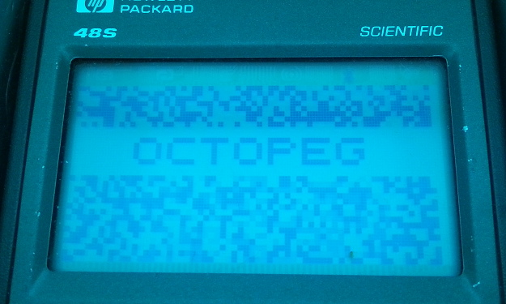

# Memory Limit

Address space of Chip-8 programs is limited to 0xFFF, 4 kibibytes, but, by spec, less 0x200 bytes as 0x000 to 0x1FF are 'reserved'. VIP: 0xEA0 and above apparently also reserved for system use. SCHIP: No such utilisation of memory, but, maximum file length results in crash. 1 byte less is OK. Also, data is uninitialised and random.

## Initial notes:

While attempting to figure out which register was being used for a Jump0 towards the end of Octopeg, I created a rom that hit Octo's memory limit. No problem I thought: I discovered that it crashed schip out unceremoniously.

## Investigation:

This is quite straight fowards. Since chip-48, we have the same loading code (I'm using sc10 since it has tabs)


```
	move.a	@d1,c		; point to the argument object
	move.a	c,d1		; (presumably a string)
	move.a	@d1,a		; get the object type
	move.p5	#02a2c,c	; string type prefix
	brne.a	c,a,doerror	; exit if it isn't a string
	add.a	5,d1		; skip the type
	move.a	@d1,a		; get the object length
	sub.a	5,a			; subtract length of length
	move.p5	#01c00,c	; this is #1000 - #0200 bytes in nibbles
	brgt.a	c,a,notlong
doerror:
	move.p5	#FFFFF,c
	move.a	c,r3
	jump.3	errexit		; string will not fit in 4 k
notlong:
...
```
And here's the dissassembly, showing they're the same from sc10 to schip:
```
000AB  C=DAT1  A
000AE  D1=C
000B1  A=DAT1  A
000B4  LC      02A2C
000BB  ?A#C    A
000BE  GOYES   000D8
000C0  D1=D1+  5
000C3  A=DAT1  A
000C6  A=A-5   A
000CC  LC      01C00 				# This is the loading code
000D3  ?C>A    A
000D6  GOYES   000E9
000D8  LC      FFFFF
000DF  R3=C    A
000E5  GOTO    00724
```
```
000AB  C=DAT1  A
000AE  D1=C
000B1  A=DAT1  A
000B4  LC      02A2C
000BB  ?A#C    A
000BE  GOYES   000D8
000C0  D1=D1+  5
000C3  A=DAT1  A
000C6  A=A-5   A
000CC  LC      01C00
000D3  ?C>A    A
000D6  GOYES   000E9
000D8  LC      FFFFF
000DF  R3=C    A
000E5  GOTO    00262
```

OK so with that shown: let's examine what's happening. The length of the string is put into A. A fixed value of 1c00 is placed into C. The largest a chip8 rom can be is 0x0200 to 0x0FFF inclusive, which is 0xE00 bytes, or 1c00 nibbles, which we can see is the value this checks for and stores in C. Then we perform ?C>A, and if the answer is yes, we can proceed, if not, we crash. A valid, albeit maximum length in A would be 1c00, and we will test if 1c00 > 1c00, and it is not, so we will crash out.

## Fixing it

The correct check is if C >= A, or A <= C. The opcode in schip at this point is 8B2, which my saturn document suggests is ?A<C, which is equivilent to C>A, so thankfully we can perhaps rely upon it. It lists that there is an A<=C as 8BA, so, let's give that a go:

```
000C6  A=A-5   A
000CC  LC      01C00
000D3  ?C>=A   A
000D6  GOYES   000E9
000D8  LC      FFFFF
```

Seems simple enough. Does this crash with a max size rom? Test program time! For this I used Octopeg, one of my own chip 8 games, that happens to run very close to the 0xE00 byte limit. I padded this up to make a version that is DFF bytes (pmax), E00 bytes (max) and E01 bytes (omax). Since sc10, it provides an error code on exit of 0xFFFFF, or 1048575d, which we will see in these test images when the data is considered too large:

1 byte under the 3584 byte limit, on SCHIP 1.1 on the left, and my SCHPC on the right:  
   
Exactly on the limit, 3584 bytes:  
   
Exactly one over the limit, 3585 bytes:  
   

Problem appears solved. The correct behavior is observed with a functioning rom in the mid right image vs the mid left, without any regression in behavior.