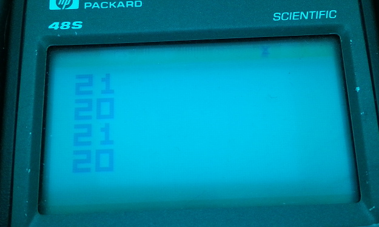
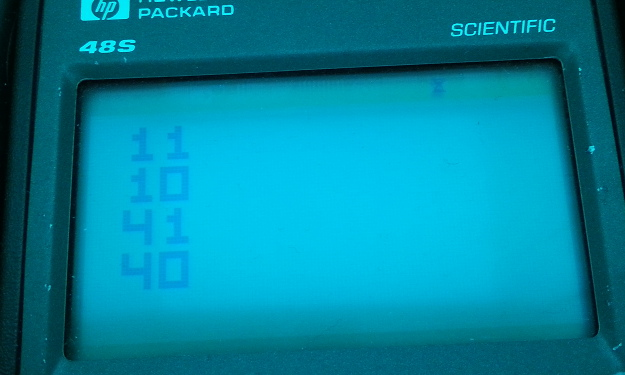

# 8XY6 & 8XYE (aka x >>= y, x <<= y)
Bit shifts X register by 1, VIP: shifts rY by one and places in rX, SCHIP: ignores rY field, shifts existing value in rX.

## Initial notes:

On some original hardware, possibly the cosmac VIP, my understanding is that the ALU was basically memory mapped such that the last nibble of this instruction was pushed to it pretty much whatever happened, and the instruction set's inclusion of 0-7 & E are simply the documented as being the useful operations.

## Investigation:

Regardless, by using quirks.8o, we were able to observe that the rotation quirk is present in Chip48, SC10 and SCHIP. If we investigate the source code for c48, we can see the following:

```
i8xy6:		; VX := VX >> 1; carry in VF
		call.3		alusetup
		move.b		c,a
		srb.b		c
		move.2		c,@d0		; store result
		move.b		a,c		; use low bit of original byte for carry
		jump.3		lsbcarry
...
i8xye:		; VX := VX << 1; carry in VF
		call.3		alusetup
		add.a		c,c
		move.2		c,@d0
		jump.3		savecarry
```

The alusetup routine loads the values of register X and Y into the HP48's C and A registers respectively. The Human readable version of these routines is thus:

```
VX := VX >> 1, carry in vF
	Load vX -> C, vY -> A
	Move byte value of C to A (to keep it safe)
	Shift Right Byte in C
	Write 2 nibbles of C to @d0, the memory address of vX
	Move byte in A into C
	3 nibble offset jump to lsbcarry

VX := VX << 1; carry in VF
	Load vX -> C, vY -> A
	Add 5 nibbles of C to C (same as a shift left for our purposes)
	Write 2 nibbles of C to @d0, the memory address of vX
	3 nibble offset jump to savecarry
```

Obviously, these completely ignore the value of vY, so it's pretty clear to see why vY is not used. This behavior can be traced to Chip-48 and these routines were not changed for Superchip 1.0.

In Superchip 1.1, some unrelated elements were changed - ALU Setup routine was changed about a bit, but, these two shift functions have exactly the same code. You might also wonder, how is the carry value for vF actually set?

The lsbcarry and savecarry labels point at pretty much the same code: the difference is that lsb carry shifts the *nibbles* of C to the right twice before running the savecarry code - savecarry takes the lowest bit of C and stores it into vF. The Chip-48 & Schip1.0 code looks like this:

```
savecarry:
		srn.a		c			; extract the carry byte
		srn.a		c
lsbcarry:
		move.p2		#01,a		; use low bit only
		and.b		a,c				
		push.a		c
		call.3		varfpd0		; get a pointer to VF
		pop.a		c
		move.b		c,@d0		; store the carry byte
		retclrc
```

Hopefully this is straight forward enough to not need an explanation beyond the existing comments. However, this routine is used every time the carry flag might need to be set with the ALU related ops, and, one of the ops in here, specifically move.p2 #01,a which loads a value of 1 into a, is quite a large instruction and a somewhat slow operation if the value is large, and also running varfpd0 blows out the A and C register so we need to work with the stack, which costs 9 cycles a piece. For superchip, 1.1 this routine was rewritten to try and eek out some more speed for these frequently called routines. First, here is the disassembly for the above code:

```
0047C  CSR     A 					# savecarry
0047E  CSR     A 					# Shifting C right by whole nibbles twice
00480  LA      01 					# set bit 1 of A to true
00487  C=C&A   B 					# And look at only that bit of C
0048B  RSTK=C 						# Push it
0048D  GOSUB   00415 				# Get vF pointer from varfpd0
00491  C=RSTK 						# Pop C
00493  DAT0=C  B 					# Write carry bit as a byte to vF
00496  RTNCC 						# Return, clearing carry bit
```

And, here is the disassembly for the Schip1.1 code:
##### Untrustworthy Disassemblers

```
003C7  CSR     A 					# savecarry.
003C9  CSR     A 					# Shifting C right by whole nibbles twice
003CB  A=0     A 					# Blow out A. # NB: Why is this going from 003CB to F? A=0 should be 2 nibbles  
003CF  A=A&C   B 					# This seems ineffective? And A with C? A is 0?
003D3  C=R4 						# Set C to v0 address...
003D6  D0=C 						# Stuff that in d0...
003D9  D0=D0+  15 					# Add 30 to d0, which is going to point us at vF's byte
003DC  D0=D0+  15
003DF  DAT0=A  B 					# Save the value of A in there. How the hell does this even work?

# What byte code is actually here?
# ...F6F6D0E40E6611C...
# F6 = CSR
# F6 = CSR
# D0 = A=0
# E4 = A=A+1 						# <<< Who could have guessed...
# 0E66 = 0Ea6 = A=A&C B
# Yeah OK, so, that's cool, A=A+1 is literally just missing completely here. What kind of dissassembly is this?

003E2  RTNCC 						# Return, clearing carry bit
```

These other functions are innocuous enough, otherwise. If we can use the initial value from the A register, instead of the value in the C register, then provided our result still ends up in C, the quirk should no longer occur.

## Fixing it

In order to fix this quirk, we can refer back to the source code, for the basic part of the operations. The main thing we need to make sure of is that C ends up containing the carry information.

```
i8xy6:		; VX := VX >> 1; carry in VF
		call.3		alusetup
		move.b		c,a		
		srb.b		c
		move.2		c,@d0		; store result
		move.b		a,c		; use low bit of original byte for carry
		jump.3		lsbcarry
```

Shift right seems like we could fix it in place. If we change move.b c,a to move.b a,c, we'll replace the value in C with that in A (so we replace vX with vY) and keep the value in A that, after we store to @d0, will restore back into C so we can call lsbcarry.

So looking this up in the Saturn guide, A=C (b) is AE8 and C=A (b) is AEA. Changing byte value 0x8A at 0x458 to 0x88 should change this function to copy A over C, and thus use vY in right shifts. However, proof reading the byte code, there's actually already a C=A a few lines below, and it's bytecode reads that C=A (b) is AE6, so, I am starting to have some concerns about this reference document! Changing the byte to 0x86 at 0x458 yields C=A in the disassembly, so that is what we're going with.

Shift left however is a more complicated matter:

```
i8xye:		; VX := VX << 1; carry in VF
		call.3		alusetup
		add.a		c,c
		move.2		c,@d0
		jump.3		savecarry
```

While this could be a simple fix - we could just use A instead of C, when we execute savecarry, while we will have saved the new value into the vX register (as this is where d0 points), we will still have the unchanged value that was in vX stored in C, which means we will not calculate the shifted out bit for vF correctly. As a result, we need to escape this space so we can move the code around without worrying about disrupting all the existing method calls. In theory this might not sound like a big deal but all goto and subroutine calls are all relative jumps, so any that jump from one side of our code to the other would need to be adjusted.

My initial cunning plan would be to do something like:
Load the address of our custom code into C
Push the address of our custom code to the stack
Jump to alusetup (instead of call) - it still has a return, so it'll pop the address we pushed off the stack and then run the code at our new area.

Is there room for that in 14 nibbles?

```
Load address into C:
34#####
Push C
06
# Jump alusetup
6###
```

That's 13 nibbles, so, that'll fit just fine. Is it faster or slower than just calling another subroutine instead?
LC with n=5, 3 + 1.5 * 5 = 10.5  
RSTK=C = 9 cycles  
GOTO = 14 cycles  
GOSUB is 15  
RTN is 11 cycles  

We would be having 11 + 9 + 14 = 34 for the above vs:

gosub alusetup = 15  
gosub customshift = 15 + 11 for the return = 26  
goto savecarry (our other routine would need this too) = 0  

so that would total 41, which means the other solution is faster, so, let's write that I guess.

And I guess the code that we'd want to run when we get there:

```
add.a a,a
move.2 a,@d0
move.b a,c
jump.3 savecarry
```

Let's get this done now even though it will probably be able to be stuffed into the space a different function will blow out will replace. Shift Left is located at 008C0, ALU Setup is located at 00392. The binary ends at 010EA, which is byte 0x882 (the file literally ends there). So let's give this a go - loading 6 nibbles into C just because that way we won't upset the decompiler, value of 0010EA.

```
008C0 -> 0x46D aligned, existing code:

7ECA C6 15C1 6CFA
35AE0100 06 67CA
ala:
53EA10006076AC
```

And our code we'll want to execute at address alpha would be:  
C4 1581 AE6 6???  

But because we're at the end of the binary, it's too far to jump with the 3 nibbles, so we'll have to use golong, which will be 8Cwxyz - this only costs 3 more cycles so it's not that much of a cost, and maybe we can rectify it later. SaveCarry is at 003C7 so we need to jump back to that from it looks like 10f3 + 6? F2CE? After fnangling with this value a little, the Disassembler is reporting a different value, so, changing this to F2D1
  
So now we're saying:  
C4 1581 AE6 8C1D2F  

So our disassembly is now looking like:

```
008C0  LC      0010EA 			<- Address of our custom code
008C8  RSTK=C 					<- wedging it into the return stack
008CA  GOTO    00392 			<- ALU Setup being called with a goto instead of gosub so return will our C
...
010EA  A=A+A   A 				<- Double A
010EC  DAT0=A  2 				<- Store it in Dat0
010F0  C=A     B 				<- Copy it to C... hmm. no
010F3  GOLONG  003C7
010F9  @
```

Made a bit of an error here! Copying A to C as a byte isn't going to work since we need the 3rd nibble. So, that in addition to dropping 1 from the golong due to being 1 nibble closer:

```
C4 1581 D6 8C2D2F
->
010EA  A=A+A   A
010EC  DAT0=A  2
010F0  C=A     A
010F2  GOLONG  003C7
010F8  @
```

Looking good! Let's give it a burl! Test program: http://johnearnest.github.io/Octo/index.html?gist=ac35eb1db0d44ece9169df169140df63

OK So that's great: Crashes immediately. Reason: vF might be insane garbage and making the hex character address point oom? Setting vF to 0 in advance fixes the problem. So yeah that's 'interesting'. New Program: http://johnearnest.github.io/Octo/index.html?gist=f86495d81f2cbfe82018b8e3a453a384

```
OCTO results:
1 1
1 0
4 1
4 0

SCHIP results:
2 1
2 0
2 1
2 0

SCHPC results:
1 1
1 0
1 0
1 0
```

Well, shift right is fine, but shift left is not working at all. Is the strategy working correctly at all or is it falling through and not running the code? v0 <<= v1 with v0 as 81 v1 as 82 strongly implies nothing has happened. Perhaps a valid strategy is to change the code to do what it normally did at this point. Having done this, it appears significantly like the code isn't running at all. I'm also feeling like I should probably include the higher byte except: I'd need to use a shift to observe it - I guess I could use BCD but oh lord, maybe let's just go for a more reliable method: A big ol jump out to where we want to be. Do the normal ALU load subroutine, then just a big jump out to where we're at:

```
008C0 -> 0x46D aligned, existing code:
7ECA C6 15C1 6CFA
7ECA 8C4280 C6 C6
ala:
e7acc824082020

008C0  GOSUB   00392
008C4  GOLONG  010EA
008CA  RTNSC
008CC  RTNSC
```

This change yields
```
1 1
1 0
4 0
4 0
```

Which is closer, as we now have the 4s. However, the carry bit is still not working. I've tried changing the code to as follows:

```
010EA  C=A     A
010EC  C=C+C   A
010EE  DAT0=C  2
010F2  GOLONG  003C7
```

Which really really should work, but, still yields 4 0 4 0. Perhaps being able to relocate and not use GOLONG will make a difference but for now this seems like a dead end.

## Fixing it: Take 2

Let's double check the Golong is dissassembling right... We have: 8C2D2F.  
10F2 is definately the address? 0x886 - 0xD * 2 = 10f2. Code is 6 nibbles, up to 10F8. We definately want to go to 03C7.  
10F8 -> 3C7 = 4344 -> 967 =>  
4344 - 32768 + ? = 967 => ? = 967 + 32768 - 4344 = 29391 = 0x72CF, which |= 0x8000 = 0xF2CF.  
The disassembler claimed the value ought to be F2D2, which is conspicuously 3 more nibbles. When I tested my result with the disassemler, I naively assumed I was making a mistake and bumped it up so that the disassembly addresss matched, but, there aren't many other GOLONGs to compare with in this binary. This is the equation I usually use though...

I mean I guess the jump out there must work, since I'm getting a pair of 4s? Maybe it doesn't? Also, wait, there IS a golong in sc11: 00B18  GOLONG  00675, and, guess what, 00675 isn't even an address for an instruction in the program. There's also a golong in SC10, which is even better because we have the source. Looks like this:
```
fx0a_ab:
	pop.a	c	; adjust stack for forced return
	jump.4	rtcarry

...

rtcarry:
nextinstr:
	call.3	realtime	; do real-time chores
	brcc	dispatch
rtcarry:
	brbs	4,a,restart	; ENTER was pressed

	; otherwise, the abort key was pressed; make a clean exit

exit:
	inton
```

And I'm not instantly sure what brbs is but inton (opcode 8080) so let's find that, there's 2 intons in the source and 2 in the dissassembly, and this is matching first:
```
00A10  GOLONG  001E4
00A16  LC      15

001DC  GOSUB   002C5
001E0  GONC    00202
001E3  ?ABIT=1 4 				# rtcarry
001E8  GOYES   0016B
001EA  INTON
001EE  ST=1    15
001F1  GOSBVL  067D2
001F8  A=DAT0  A
001FB  D0=D0+  5
001FE  PC=(A)
00202  C=R3 +  A 				# Dispatch
```

So realistically I can assume that the real target address is 1E3.  
The bytecode for the jump is: 8C1D7F = F7D1, so, A16 + jump = 1E3  
ala 2582 - 32768 + 30673 ~= 483 ? The uh, working the math through, the left hand side works out 487, based on information I think I know??

##### More untrustworthy Disassemblers...
OK so, after some research:
While GOSUB and GOSUBL count from the end of the address, GOTO and GOLONG instructions count from the end of only the initial, non address part of the instruction. This means GOSUB = start + value + 4, GOSUBL = start + value + 6, GOTO = start + value + 1, GOLONG = start + value + 2.

Why? That's a good question. I, naively, assumed that they would work in the same way as one another and be based on the whole instruction lenght, hence the +6s earlier.

Additionally, the disassembler I'm using gives an off by +1 error for the calculation and display of the one example I have for GOLONG. My mathematic result of 487 above is based on the address of the LC instruction after the GOLONG (A16), which would be correct if this was GOSUBL - this result is actually off by a value of 4. If we start by dropping the 6 nibbles, to go back to A10, the start of the instruction, when we apply our jump value of F7D1, we'd be put at 481, 0x1E1. We're confident the actual target is 1E3, 2 nibbles afterwards, ie making the jump value relative to the end of the 8C. Since this relative value was calculated by an assembler that didn't generate a horrendously broken programs, we can say with a reasonable confidence that the GOLONG relative address is clearly based on the position of the 8C part of the instruction, and that the disassembler, which shows a resulting address of 1E4 instead of 1E3, knows of this difference, but is off by +1 in this case. No idea as to why that would be, I thought perhaps maybe the GOVLNG command could be 3 nibbles and they got swapped, but it's still only 2, so perhaps just an error in the arithmatic? The GOSUBL command, however, has no such calculation mistakes in the disassembler and correctly points at the resulting addresses. Since I'd worked out the addressing for fixing Jump0's GOSUB call, I applied that knowledge here thinking I had it all figured out, and I, clearly, was wrong...

Anyway, stabbing in this newfound information, it is plain to see that the correct values are:

```
8C4 + 2 jump to 10EA = 0x824

From 0x46D
E7ACC824082020
7ECA 8C4280 20 20

008C0  GOSUB   00392
008C4  GOLONG  010EA
008CA  RTNSC
008CC  RTNSC
...
10F2 + 2 jump to 03C7 = F2D3

From 0x882
6D7C511CC8D3F2
D6 C6 15C1 8C3D2F

010EA  C=A     A
010EC  C=C+C   A
010EE  DAT0=C  2
010F2  GOLONG  003C8
```
So, we can see from this that the Disassembler is giving an off by one ONLY when going backwards. Thanks Decode!

Anyway, this a) didn't crash, b) didn't not work and c) didn't do anything bad, and so, perhaps finally, this quirk has been put to bed:

Octo's standard behavior:  
  
SCHIP 1.1 (1.0 & C48 behave the same):  
  
SCHPC:  
  

## After thoughts:

So, in the process of fixing this I've learnt quite a lot about the tools I have available to me, and the format of the binaries for the calculator. Having added the extra data on the end meant I had to learn about the header the files have, which includes a length value that needs to be set correctly. I learnt about the difference between jumps and subroutine calls, and the flaws in DECODE and in my saturn guide. It's all been quite terrible, really. However, the best part is, now that I finally have it all working, I've figured out how to do it in place. So, I didn't put it in before, but, here are the wrappings for shift left

```
008B8  LC      E
008BB  ?C#A    P
008BE  GOYES   008CE
008C0  GOSUB   00392 		# Shift left
008C4  C=C+C   A
008C6  DAT0=C  2
008CA  GOTO    003C7
008CE  RTNSC
008D0  ...
```

Basically, all the arithmetic operations are tested for by loading a value into C, comparing it with A, and if they don't match, jumping over the next instruction. Shift left is the last ALU instruction of the 8 available, and, if it isn't this one, and it hasn't been any of the previous ones, we return with the carry bit set which tells the interpreter that the instruction was not recognised. So, you can see that the GOYES points at a RTNSC the other side of the our shift left handler, and that RTNSC is a 2 nibble instruction. There are other RTNSC instructions, if we could point GOYES at one of those, shift our other instructions by 2 nibbles into now free 008CE, and fit C=A into the beginning at 008C4, which would have avoided ~every single thing I hard to figure out - if I'd realised this sooner, or just been a bit more pragmatic, I'm not sure if I would have been better off or not. I'll switch to this solution, I think, as it will be far faster:

```
Bytecode: 90601
008BB  ?C#A    P
008BE  GOYES   008CE
```

So ?C#A P is likely 9a6yz, where zy is a 2 bit relative address, so if it works like the others (it does?) that'll be ~+= 128. Our GOYES goes from 8BE to 8CE which is 0x10 more, and that's the exact value of our xy, but the 9a6 is on 8BB, so, it's going from the address value of the GOYES in the disassembly, so, our range here is from 8BE. Can we find a RTNSC in that area? There's one at 0066B and 00A6F, but these are both just too far to reach from 8BE; our window is only ~7BE to 9BE. However, the opcode for RTNSC is 02 - much like chip8, if we can find that pair of nibbles somewhere in that range, we can jump to it and it should just read it as an instruction and I guess safely kill the program. The chances of finding it in there are... actually pretty good? In random noise, there'd be a 1 in 256 chance that a given pair of nibbles would be 02, and, my opinion of schip at the moment is that it really isn't that different from random noise... plus we have a 256 nibble window which will have 255 pairs in it, so, only thing to do is to just scan through nibble by nibble and see if I can see a 02...

```
00912  RTNCC
00914  GOTO    00B16
00918  A=R4    A
0091E  LC      001C5

Bytecode:
03 6102 81AF1F 345C10
```

Observe that there is, by pure luck, a 02 in the jump instruction's relative address. It's address is at 00916, which requires a jump of only 0x58. That's... actually gonna work, I think? So! Replacing 0x10 with 0x58 should do the job. There's another 02 at 97C as part of an LC operation, so, 2 chances at getting lucky!

```
Bytecode before
906 01 7ECA C6 15C1 6CFA 02
Byecode after
906 85 7ECA D6 C6 15C1 6AFA

008BB  ?C#A    P
008BE  GOYES   00916
008C0  GOSUB   00392
008C4  C=A     A
008C6  C=C+C   A
008C8  DAT0=C  2
008CC  GOTO    003C7
```

Now all we need is a test program: http://johnearnest.github.io/Octo/index.html?gist=a4403699bbaf29d1fa9408ad00d8eea1

This, when the button is pushed, octo halts due to invalid arithmetic, and schpc crashes out with a 550d in the same way that schip does, sooooo, I guess that's... good?? I've dropped the code I added from the end and restored the original binary length value. I mean, we'll know for next time what our options are so this has been worthwhile but, the solution here is superior, I think.